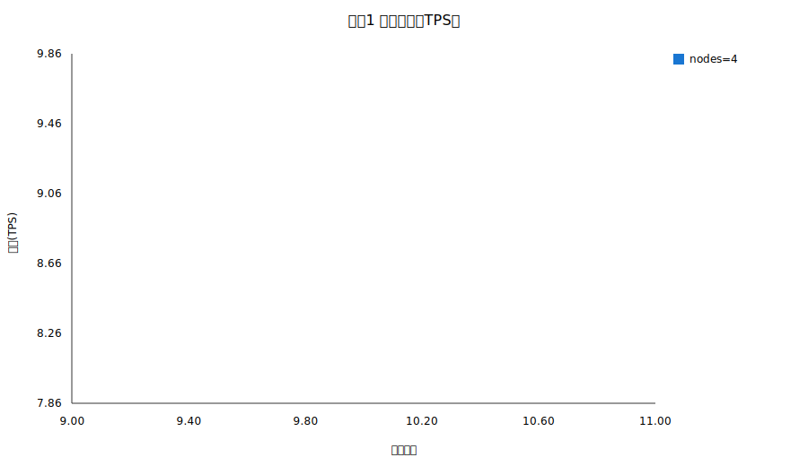
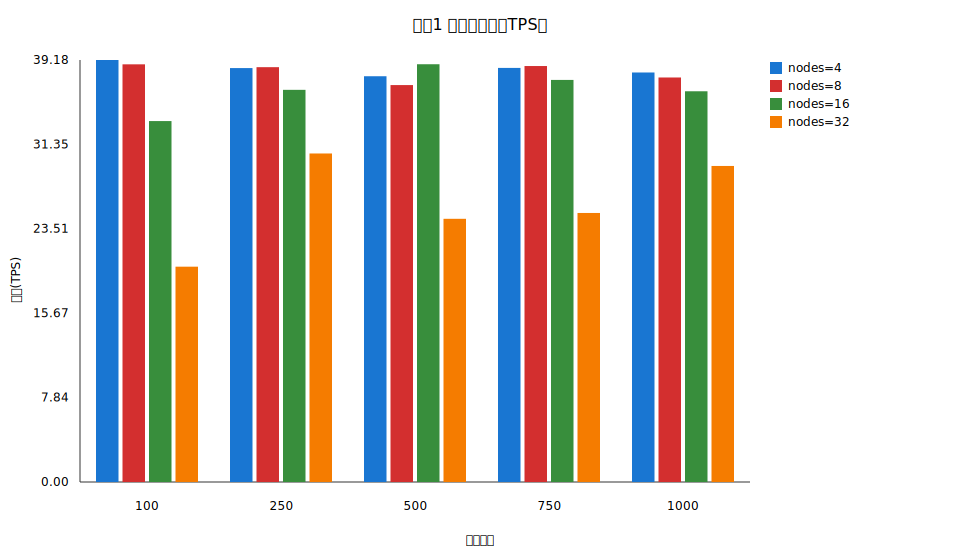

# 实验一报告

## 摘要
实验点数: 1
平均完成时间(s): 0.901563
平均延迟(ms): 3.506556
平均P99延迟(ms): 12.175000
平均CPU使用率(%): 12.330000
平均网络带宽(Mbps): 0.207608
平均RocksDB写延迟(ms): 3.000000
写放大估计: 1137665.00
明细:
节点:4 交易数:10 完成时间(s):0.901563 平均延迟(ms):3.506556 P99(ms):12.175000 CPU(%):12.330000 网络(Mbps):0.207608 RocksDB写延迟(ms):3.000000

## 图表

