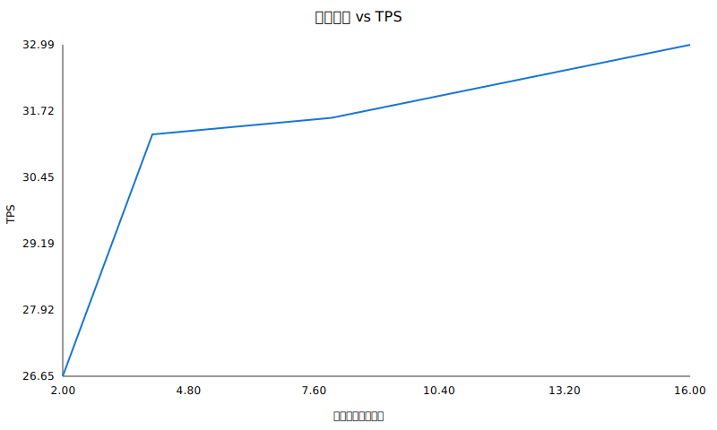
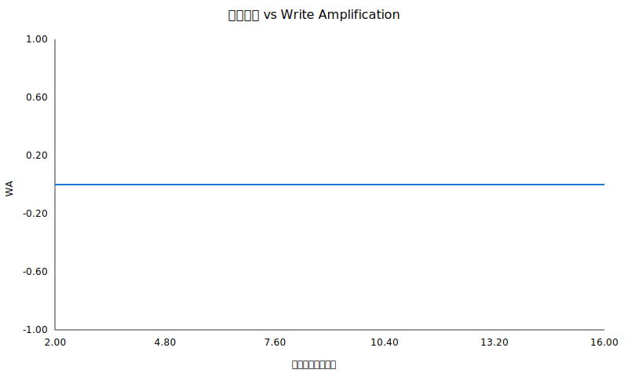
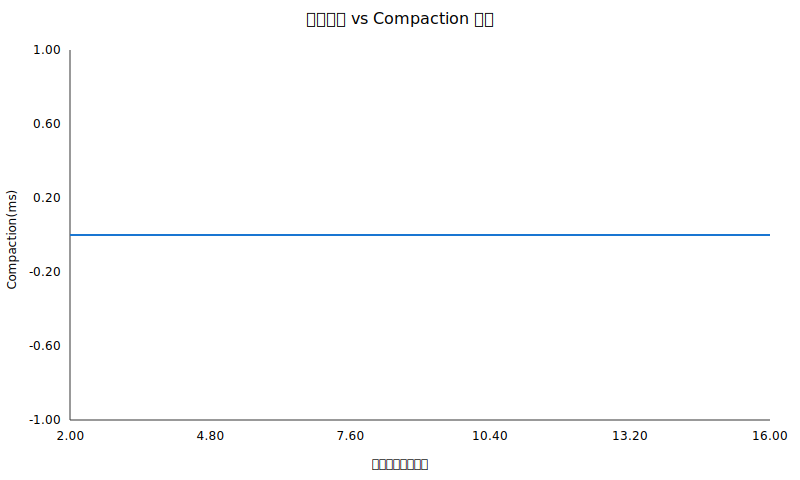
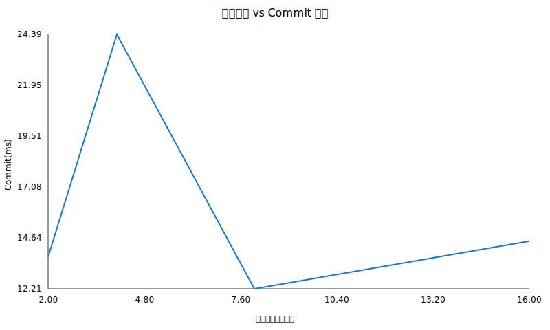
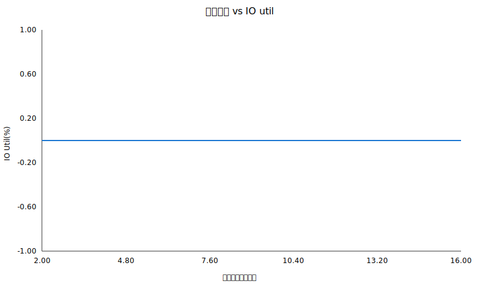

# 实验二报告

## 摘要
总节点数: 32
交易数: 10000
重复次数: 1
明细:
共享规模:2 TPS:9.45 Commit(ms):198.82 WA:0.0000 Compaction(ms):0.00 IO Util(%):0.00
共享规模:4 TPS:8.38 Commit(ms):250.10 WA:0.0000 Compaction(ms):0.00 IO Util(%):0.00
共享规模:8 TPS:0.00 Commit(ms):0.00 WA:0.0000 Compaction(ms):0.00 IO Util(%):0.00
共享规模:16 TPS:0.48 Commit(ms):10.37 WA:0.0000 Compaction(ms):0.00 IO Util(%):0.00

## 图表

