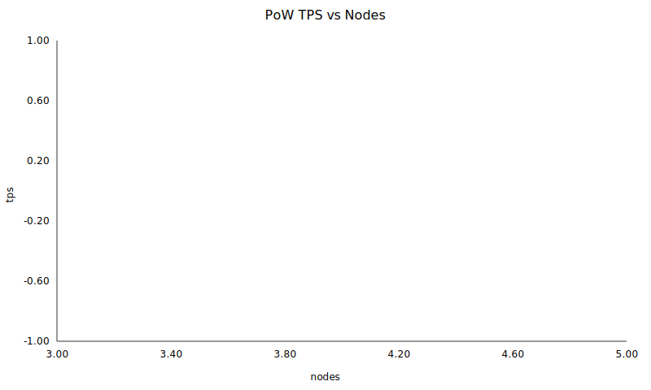
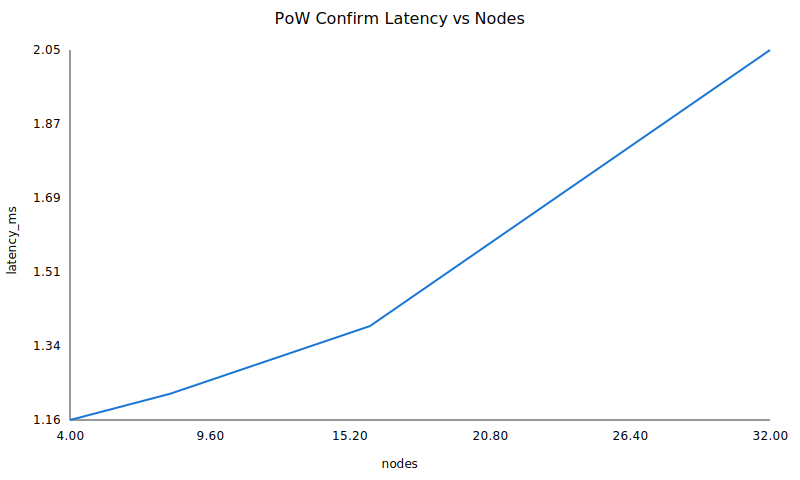
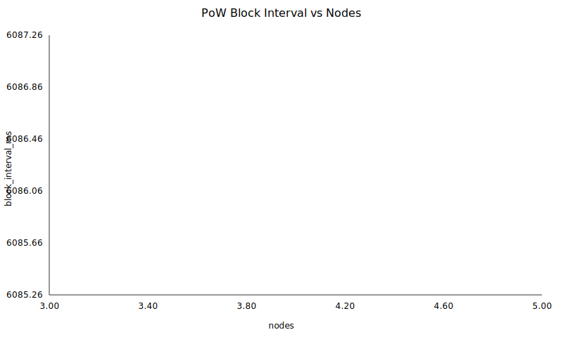
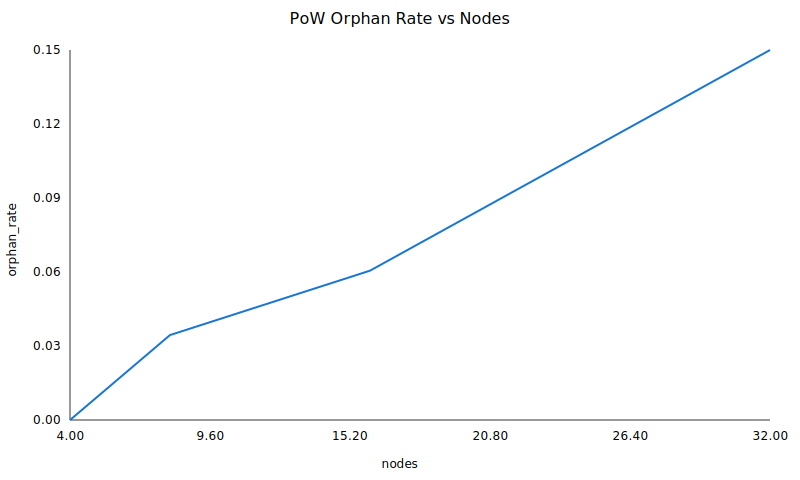

# 实验七报告

## 摘要
实验七：基于 PoW 算法的节点扩展性与性能测试
节点规模: 4
单节点 CPU: 1 Core
PoW 难度: 10
目标出块时间(ms): 6000.00
每块交易数: 300
持续时长(s): 20
目标发送 TPS: 60
nodes=4 TPS=0.00 latency=0.00ms block_interval=6086.26ms orphan=0.0278 cpu=6.36%

## 图表

