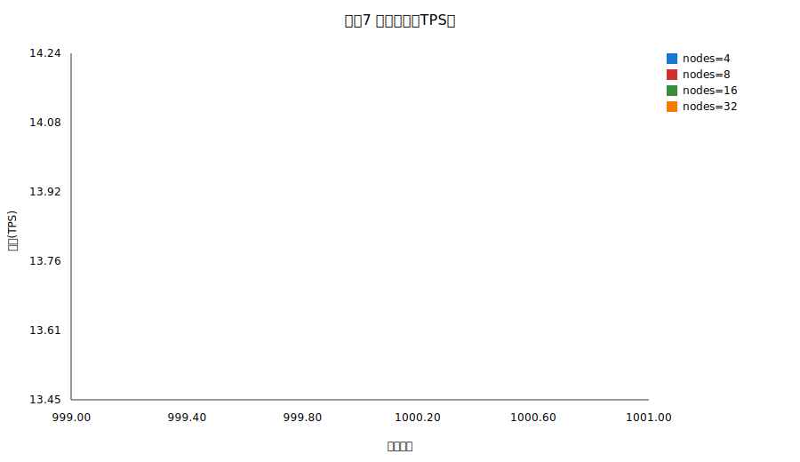
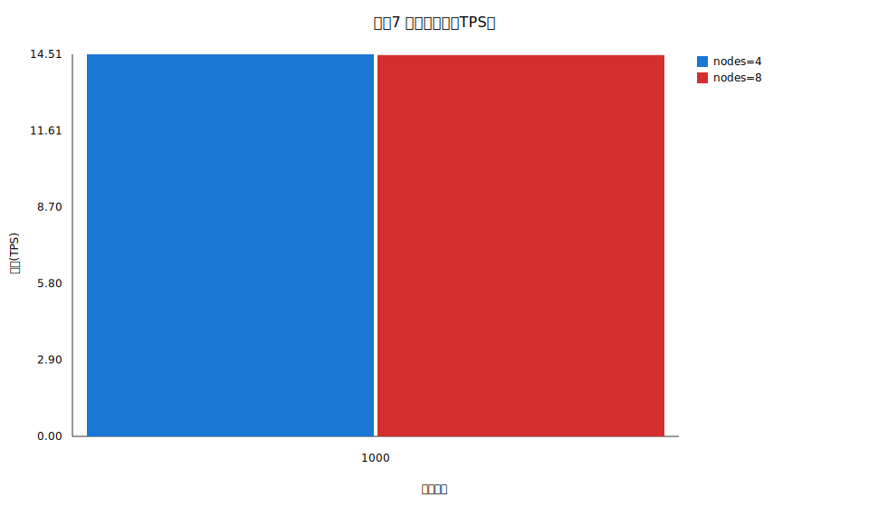

# 实验七报告

## 摘要
实验七：基于 PoW 算法的节点扩展性与性能测试
节点规模: 4,8
单节点 CPU: 1 Core
PoW 难度: 12
目标出块时间(ms): 12000.00
每块交易数: 1000
持续时长(s): 15
目标发送 TPS: 50
nodes=4 TPS=45.23 latency=7.20ms block_interval=12109.92ms orphan=0.0000 cpu=85.68%
nodes=8 TPS=45.87 latency=8.37ms block_interval=5889.11ms orphan=0.0208 cpu=80.47%

## 图表

